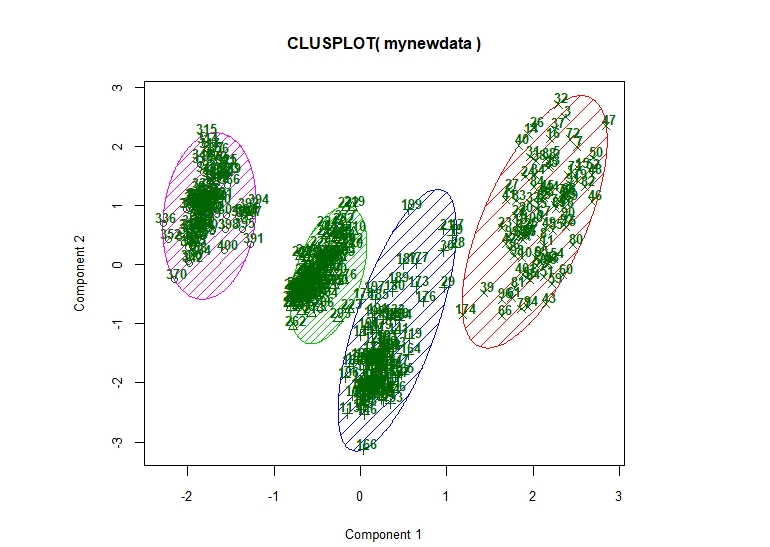
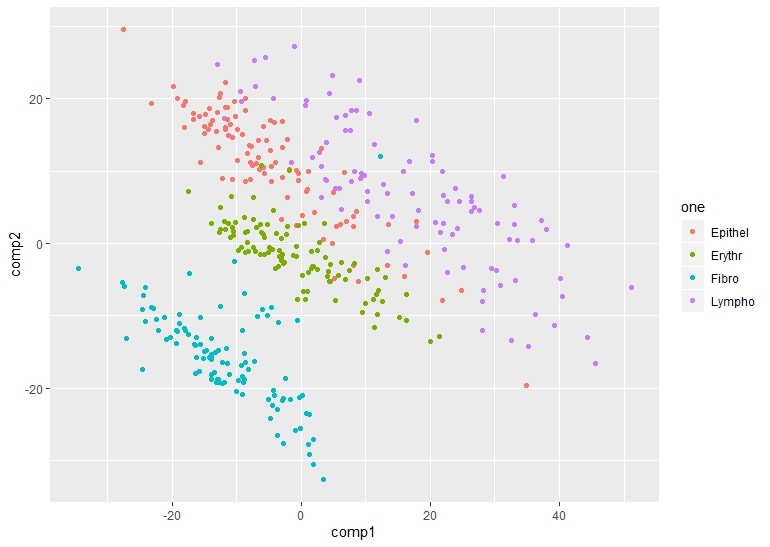
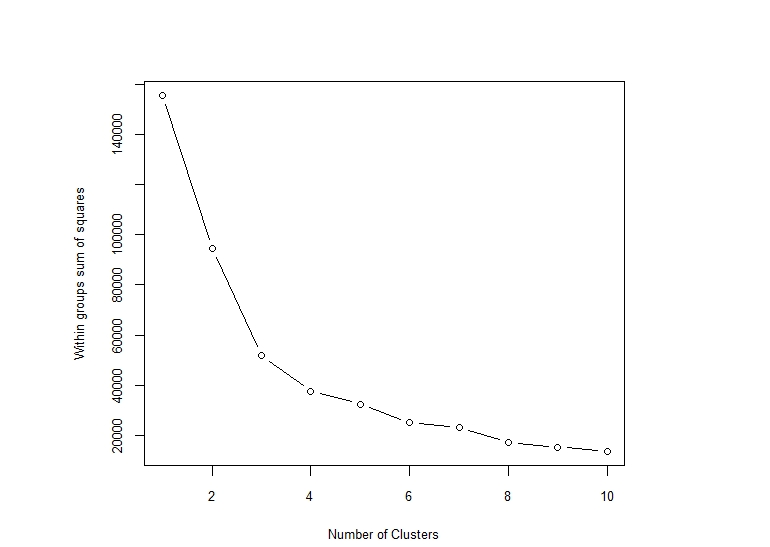

InfraredClusters
================

You could copy this code for similiar infrared spectra/analytical datasets.

``` library(data.table)

par(pin=c(5,4),mfrow=c(1,1),font=2,ps=10,family="sans")
x <- seq(900,2300,2)
#import file
file <- 'C:/ftirdb/R code/alldata.csv'

spectra <- read.csv(file, header = TRUE, row.names=NULL)

#pca using dataframe
pca <- prcomp(spectra,
              center = TRUE,
              scale =TRUE,
              rank. = 10,
)
summary(pca)

plot(pca$x[, 1], pca$x[, 2], pch=10, bg=c("blue","cyan","green","red"), main =
       "PCA", xlab = "PC1", ylab = "PC2") 


#create dataframe with pca
mydata<-data.frame(pca$x[, 1],pca$x[, 2]) 
#calculate sum of squares and plot
withingroupss <- (nrow(mydata)-1)*sum(apply(mydata,2,var))
for (i in 2:10) withingroupss[i] <- sum(kmeans(mydata,centers=i)$withinss)
plot(1:10, withingroupss[1:10], type="b", xlab="Number of Clusters",
     ylab="Within groups sum of squares") 


#use sum of squares to decide best number of clusters to use 
#create clusters using kmeans
myclusters <- kmeans(spectra,4) 
#label the data
one <- c(rep("Lympho",100),rep("Epithel",100),rep("Erythr",100),rep("Fibro",101))
mynewdata <- data.frame(mydata, myclusters$cluster,one)
View(mynewdata) 
#outputclusters
library(cluster)
#initial plot
clusplot(mynewdata, myclusters$cluster,color=TRUE, shade=TRUE, labels=3, lines=0)

library(ggplot2)
library(plyr)
mydata$cluster <- as.character(myclusters$cluster)
mynewdata <- rename(mydata, c("pca.x...1."="comp1", "pca.x...2."="comp2"))
#make the plot look nicer with Ggplot :) 

p <- ggplot() +
  geom_point(data = mynewdata, 
             mapping = aes(x = comp1, 
                           y = comp2, 
                           colour = one,
                           ))


print(p)

```

 



Using pie charts i experimented with different numbers of clusters

    a1 <- mynewdata[ which((mynewdata$myclusters.cluster==1) &(mynewdata$one=='Lympho')), ]
    b1 <- mynewdata[ which((mynewdata$myclusters.cluster==1) &(mynewdata$one=='Epithel')), ]
    c1 <- mynewdata[ which((mynewdata$myclusters.cluster==1) &(mynewdata$one=='Erythr')), ]
    d1 <- mynewdata[ which((mynewdata$myclusters.cluster==1) &(mynewdata$one=='Fibro')), ]
    e1 <- mynewdata[ which((mynewdata$myclusters.cluster==1) &(mynewdata$one=='E')), ]
    f1 <- mynewdata[ which((mynewdata$myclusters.cluster==1) &(mynewdata$one=='F')), ]

    a2 <- mynewdata[ which((mynewdata$myclusters.cluster==2) &(mynewdata$one=='Lympho')), ]
    b2 <- mynewdata[ which((mynewdata$myclusters.cluster==2) &(mynewdata$one=='Epithel')), ]
    c2 <- mynewdata[ which((mynewdata$myclusters.cluster==2) &(mynewdata$one=='Erythr')), ]
    d2 <- mynewdata[ which((mynewdata$myclusters.cluster==2) &(mynewdata$one=='Fibro')), ]
    e2 <- mynewdata[ which((mynewdata$myclusters.cluster==2) &(mynewdata$one=='E')), ]
    f2 <- mynewdata[ which((mynewdata$myclusters.cluster==2) &(mynewdata$one=='F')), ]

    a3 <- mynewdata[ which((mynewdata$myclusters.cluster==3) &(mynewdata$one=='Lympho')), ]
    b3 <- mynewdata[ which((mynewdata$myclusters.cluster==3) &(mynewdata$one=='Epithel')), ]
    c3 <- mynewdata[ which((mynewdata$myclusters.cluster==3) &(mynewdata$one=='Erythr')), ]
    d3 <- mynewdata[ which((mynewdata$myclusters.cluster==3) &(mynewdata$one=='Fibro')), ]
    e3 <- mynewdata[ which((mynewdata$myclusters.cluster==3) &(mynewdata$one=='E')), ]
    f3 <- mynewdata[ which((mynewdata$myclusters.cluster==3) &(mynewdata$one=='F')), ]

    a4 <- mynewdata[ which((mynewdata$myclusters.cluster==4) &(mynewdata$one=='Lympho')), ]
    b4 <- mynewdata[ which((mynewdata$myclusters.cluster==4) &(mynewdata$one=='Epithel')), ]
    c4 <- mynewdata[ which((mynewdata$myclusters.cluster==4) &(mynewdata$one=='Erythr')), ]
    d4 <- mynewdata[ which((mynewdata$myclusters.cluster==4) &(mynewdata$one=='Fibro')), ]
    e4 <- mynewdata[ which((mynewdata$myclusters.cluster==4) &(mynewdata$one=='E')), ]
    f4 <- mynewdata[ which((mynewdata$myclusters.cluster==4) &(mynewdata$one=='F')), ]

    a5 <- mynewdata[ which((mynewdata$myclusters.cluster==5) &(mynewdata$one=='A')), ]
    b5 <- mynewdata[ which((mynewdata$myclusters.cluster==5) &(mynewdata$one=='B')), ]
    c5 <- mynewdata[ which((mynewdata$myclusters.cluster==5) &(mynewdata$one=='C')), ]
    d5 <- mynewdata[ which((mynewdata$myclusters.cluster==5) &(mynewdata$one=='D')), ]
    e5 <- mynewdata[ which((mynewdata$myclusters.cluster==5) &(mynewdata$one=='E')), ]
    f5 <- mynewdata[ which((mynewdata$myclusters.cluster==5) &(mynewdata$one=='F')), ]

    a6 <- mynewdata[ which((mynewdata$myclusters.cluster==6) &(mynewdata$one=='A')), ]
    b6 <- mynewdata[ which((mynewdata$myclusters.cluster==6) &(mynewdata$one=='B')), ]
    c6 <- mynewdata[ which((mynewdata$myclusters.cluster==6) &(mynewdata$one=='C')), ]
    d6 <- mynewdata[ which((mynewdata$myclusters.cluster==6) &(mynewdata$one=='D')), ]
    e6 <- mynewdata[ which((mynewdata$myclusters.cluster==6) &(mynewdata$one=='E')), ]
    f6 <- mynewdata[ which((mynewdata$myclusters.cluster==6) &(mynewdata$one=='F')), ]

    par(pin=c(3,2),mfrow=c(2,2),font=2,ps=10,family="sans")
    slices <- c(NROW(a1),NROW(b1),NROW(c1),NROW(d1),NROW(e1),NROW(f1))
    slices2 <- c(NROW(a2),NROW(b2),NROW(c2),NROW(d2),NROW(e2),NROW(f2))
    slices3 <- c(NROW(a3),NROW(b3),NROW(c3),NROW(d3),NROW(e3),NROW(f3))
    slices4 <- c(NROW(a4),NROW(b4),NROW(c4),NROW(d4),NROW(e4),NROW(f4))
    #slices5 <- c(NROW(a5),NROW(b5),NROW(c5),NROW(d5),NROW(e5),NROW(f5))
    #slices6 <- c(NROW(a6),NROW(b6),NROW(c6),NROW(d6),NROW(e6),NROW(f6))


    lbls <- c("Lympho","Epithel","Erythr","Fibro","colla")
    pie(slices, labels = lbls, main="Pie Chart of cell types in cluster 1 ")
    pie(slices2, labels = lbls, main="Pie Chart of cell types in cluster 2 ")
    pie(slices3, labels = lbls, main="Pie Chart of cell types in cluster 3 ")
    pie(slices4, labels = lbls, main="Pie Chart of cell types in cluster 4 ")
    pie(slices5, labels = lbls, main="Pie Chart of cell types in cluster 5 ")
    pie(slices6, labels = lbls, main="Pie Chart of cell types in cluster 5 ")
